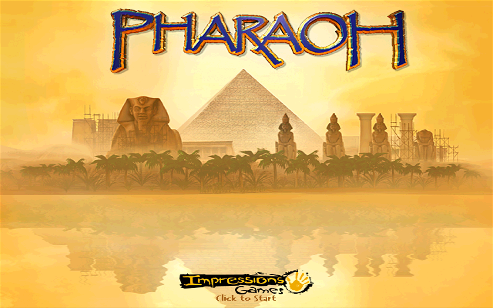

# Pharaoh on Apple Silicon Mac via Whisky

Run **Pharaoh** (Sierra / Impressions, 1999) on an Apple Silicon Mac via
Whisky, Gcenx Game Porting Toolkit 1.1, and cnc-ddraw.

This is a documented partial result from the retrorts-mac run on 2026-05-23.
The title screen renders and the engine reaches its game loop. Main-menu
interactivity was not proven.

Tested environment:

| Component | Value |
|---|---|
| Mac | Apple Silicon, M-series |
| macOS | 15.6.1 Sequoia |
| Wine wrapper | Whisky 2.3.5 |
| Wine runtime | Gcenx Game Porting Toolkit 1.1 cask |
| Bottle | `winxp64` |
| DirectDraw shim | cnc-ddraw v7.1.0.0 |
| Game media | Pharaoh CD / ISO, archive.org item `pharaoh_202104` |



## Status

| Aspect | State |
|---|---|
| Executable launches | Working |
| DirectDraw initializes | Working; RGB565 surface created |
| DirectSound initializes | Working |
| Title screen renders | Working |
| Click through title screen | Blocked in this test pass |
| Main menu / gameplay | Not proven |
| Capture reliability | Partial; Wine/GPTK render surface was hard to capture consistently |
| CrossOver requirement | None for this recipe; Whisky + GPTK are free |

## TL;DR

1. Install Whisky 2.3.5 and Gcenx Game Porting Toolkit:

   ```sh
   brew install --cask whisky
   brew install --cask gcenx/wine/game-porting-toolkit
   ```

2. Create or point at a `winxp64` Whisky bottle.
3. Mount a Pharaoh CD / ISO at `/Volumes/Pharaoh`.
4. Extract the installer payload manually with `unshield`; `Setup.exe` exited
   without copying files under this Wine runtime.
5. Copy `Audio/` and `Binks/` from the CD / ISO into the installed game folder.
6. Drop cnc-ddraw v7.1.0.0 `ddraw.dll` and `ddraw.ini` next to `Pharaoh.exe`.
7. Add a Wine per-app DLL override:

   ```text
   HKCU\Software\Wine\AppDefaults\Pharaoh.exe\DllOverrides
   ddraw = native,builtin
   ```

8. Optional: set a Wine virtual desktop at `1024x768`.
9. Launch `Pharaoh.exe`.

Expected result for the proven setup: title screen renders with
`PHARAOH`, Sphinx / pyramid art, Impressions Games logo, and `Click to Start`.

## Fullscreen / native resolution

Pharaoh's original DirectDraw surface is small on modern Macs. For a screen-
filling result, use cnc-ddraw scaling instead of increasing the game's internal
resolution:

```sh
PHARAOH_DIR="$WINEPREFIX/drive_c/Program Files/Sierra/Pharaoh" \
  ./scripts/configure-fullscreen.sh
```

The script updates `ddraw.ini` next to `Pharaoh.exe` with:

```ini
renderer=opengl
windowed=false
border=false
maintas=true
boxing=true
width=0
height=0
```

`width=0` and `height=0` let cnc-ddraw detect the active display. `maintas`
and `boxing` preserve the 4:3 artwork with letterboxing or pillarboxing instead
of stretching it.

## Full Recipe

### 1. Install tools

```sh
brew install --cask whisky
brew install --cask gcenx/wine/game-porting-toolkit
brew install unshield
```

The retrorts run also installed `cliclick` for input testing. It did not solve
the title-screen click-through wall.

### 2. Create a `winxp64` bottle

Use Whisky's GUI or initialize a prefix directly:

```sh
export WINEPREFIX="/path/to/pharaoh-bottle"
export WINE="/Applications/Whisky.app/Contents/Resources/Libraries/Wine/bin/wine64"

mkdir -p "$WINEPREFIX"
"$WINE" wineboot --init
"$WINE" winecfg
```

In `winecfg`, set the Windows version to Windows XP / XP 64-bit. A virtual
desktop at `1024x768` is optional but matched the title-screen capture.

### 3. Mount the Pharaoh media

The proven run used the archive.org `pharaoh_202104` ISO. The ISO was about
668 MB and mounted as `/Volumes/Pharaoh`.

```sh
hdiutil attach /path/to/pharaoh.iso
```

No game files are included in this repository. Use your own disc or ISO.

### 4. Install by extraction, not `Setup.exe`

Under this Wine runtime, `Setup.exe` exited without populating the install
directory. Manual InstallShield extraction worked.

```sh
export ISO="/Volumes/Pharaoh"
export GAME="$WINEPREFIX/drive_c/Program Files/Sierra/Pharaoh"

mkdir -p "$GAME"
unshield -d "$GAME" x "$ISO/Setup/data1.cab"
cp -R "$ISO/Audio" "$GAME/"
cp -R "$ISO/Binks" "$GAME/"
```

Depending on the disc layout, `data1.cab` may live at the ISO root rather than
`Setup/data1.cab`. Inspect the mounted image and adjust the path.

### 5. Install cnc-ddraw

Download cnc-ddraw v7.1.0.0 from upstream and copy these files next to
`Pharaoh.exe`:

```text
ddraw.dll
ddraw.ini
Shaders/        optional, if present in the release archive
```

The tested global setting was:

```ini
renderer=opengl
```

The important part is making Wine load the folder-local `ddraw.dll` instead of
Wine's builtin DirectDraw implementation.

### 6. Add the DLL override

Use `wine reg add`:

```sh
"$WINE" reg add 'HKCU\Software\Wine\AppDefaults\Pharaoh.exe\DllOverrides' \
  /v ddraw /d native,builtin /f
```

Equivalent `user.reg` entry:

```reg
[Software\\Wine\\AppDefaults\\Pharaoh.exe\\DllOverrides]
"ddraw"="native,builtin"
```

Per-app is intentional. It keeps this override from changing other games in the
same bottle.

### 7. Launch

```sh
cd "$GAME"
"$WINE" Pharaoh.exe
```

For a debug launch:

```sh
WINEDEBUG=+loaddll,+ddraw "$WINE" Pharaoh.exe
```

The run that produced the screenshot loaded the native folder-local
`DDRAW.dll`, initialized DirectDraw, and reached the title screen.

## Evidence

[`evidence/status.txt`](evidence/status.txt) is the game's own status file from
the proven bottle. Relevant lines:

```text
OK :GFX DirectDraw enabled.
OK :DD surface_format is RGB 565.
OK :Direct draw initialised.
OK :Setup loaded DAT files.
OK :Direct sound initialised.
OK :Launching game loop.
```

The screenshot in [`screenshots/pharaoh-title-screen.png`](screenshots/pharaoh-title-screen.png)
shows the rendered title screen. It is not proof of main-menu or in-game
playability.

## Known Caveats

| Issue | Result |
|---|---|
| `Setup.exe` install path | Exited without copying files; manual `unshield` extraction was required. |
| Click / input delivery | `cliclick`, AppleScript, and Quartz click attempts did not advance past the title screen in the GPTK 1.1 setup. |
| Main menu | No screenshot with `New Career`, `Continue`, `Load`, or `Options` was captured. |
| Capture pipeline | Some Wine/GPTK surfaces captured as black or offscreen `500x500` windows even while `status.txt` showed a running game loop. |
| CD detection | Failed when `/Volumes/Pharaoh` was absent; mount the ISO or copy/register the CD assets before launch. |
| Intro videos | Later retry logs reported missing `smk/*.smk` opens after CD-path experiments; keep `Binks/` and CD paths aligned. |
| macOS / hardware coverage | Only macOS 15.6.1 Sequoia on Apple Silicon was tested. No claim for Intel Macs or macOS 16+. |

## Engine Notes

Pharaoh uses the same Impressions 2D city-builder family as **Caesar III** and
**Emperor: Rise of the Middle Kingdom**. The DirectDraw fix is therefore close
to the working Emperor recipe: Whisky bottle, cnc-ddraw next to the executable,
and a native-first `ddraw` override.

Do not overstate that transfer. Emperor was proven playable; this Pharaoh pass
was proven only to title screen plus engine loop.

## Helper Script

[`scripts/prepare-pharaoh-whisky.sh`](scripts/prepare-pharaoh-whisky.sh)
automates the reversible parts of the recipe:

- validate the ISO mount, Wine binary, prefix, and cnc-ddraw zip;
- run `wineboot --init`;
- extract InstallShield payload with `unshield`;
- copy `Audio/` and `Binks/`;
- unpack cnc-ddraw next to `Pharaoh.exe`;
- set `ddraw=native,builtin` for `Pharaoh.exe`.

It does not download Pharaoh or cnc-ddraw and does not include any game files.

## Repo Contents

```text
README.md
evidence/status.txt
screenshots/pharaoh-title-screen.png
scripts/prepare-pharaoh-whisky.sh
```

## Credits

cnc-ddraw by FunkyFr3sh. Whisky by Isaac Marovitz. Game files are not included.
This repository is documentation and local setup automation only.
